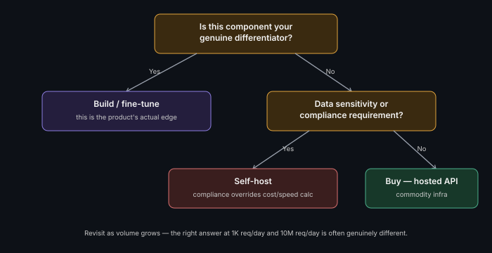

# Build vs Buy for AI Components

**Read time:** 3 min

---

A recurring, legitimate architecture decision: use a hosted API
(inference provider, vector DB service, orchestration framework) vs.
build/self-host the equivalent — and it's a common interview question
specifically because there's no universally correct answer.

## The decision factors that actually matter

- **Is this component your genuine differentiator, or infrastructure?**
  If the specific quality of this component *is* the product, build/
  fine-tune matters more. If it's commodity infrastructure (a vector
  store, a base model call), buying is almost always right.
- **Data sensitivity and compliance requirements** — self-hosting may be
  required, not just preferred, for certain regulated data — this can
  override a pure cost/speed calculation entirely
- **Team's actual operational capacity** — self-hosting an inference
  stack is real ongoing operational work (scaling, monitoring, model
  updates); "we could build this" and "we should operate this
  long-term" are different questions
- **Speed to market vs. long-term cost** — hosted APIs are almost always
  faster to integrate; self-hosting can be cheaper at real scale, but
  only past a volume threshold worth calculating explicitly, not assuming

## The pattern most teams actually land on

Buy for genuinely commodity infrastructure (base model inference, vector
storage) early on; build/customize only the layer that's actually
differentiated (the RAG pipeline logic, the agent orchestration, the
prompts/fine-tuning specific to the product). Revisit the calculation as
volume grows — the right answer at 1,000 requests/day and 10 million
requests/day is often genuinely different.

## Interview signal

Don't default to "build everything" to seem more technically impressive
— a senior answer explicitly separates what's commodity (buy) from
what's differentiated (build), and says so out loud.

---
*Part of [AI Systems Architecture](../README.md) → [AI Application Architecture Fundamentals](./README.md)*
