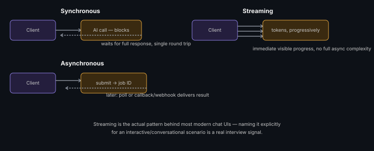

# Sync vs Async Inference Patterns

**Read time:** 3 min

---

AI inference calls are almost always slower and less predictable than a
normal API call — the sync-vs-async decision here matters more than in
most other parts of a system, and it's a very common interview probe.

## Synchronous — client waits for the result

The client calls, blocks, and gets the AI response directly in the
response. Simple mental model, but the client is exposed to the AI
call's full latency (and any tail-latency spikes) directly.

**Use when:** the user is actively waiting for this specific result in
the UI (a chat response), and latency is within an acceptable
interactive range.

## Asynchronous — submit now, collect later

The client submits a request, gets an immediate acknowledgment (a job
ID), and either polls or receives a callback/webhook/push notification
when the result is ready.

**Use when:** the AI task is long-running (document processing, batch
generation), or when decoupling the client from inference latency
matters more than immediate feedback.

## The middle ground worth naming: streaming

Neither fully sync nor fully async — the response streams back token by
token as it's generated, so the client sees progress immediately even
though full completion still takes time. This is the actual pattern
behind most modern chat interfaces, and worth naming explicitly if the
scenario is interactive (it addresses the "sync feels too slow" problem
without the complexity of full async job handling).

## Interview signal

If asked to design a chat-based AI feature, defaulting straight to
"synchronous API call" without mentioning streaming is a missed
opportunity — streaming is the actual production pattern for anything
user-facing and conversational, and naming it signals real familiarity
with how these systems are actually built today.

---
*Part of [AI Systems Architecture](../README.md) → [AI Application Architecture Fundamentals](./README.md)*
