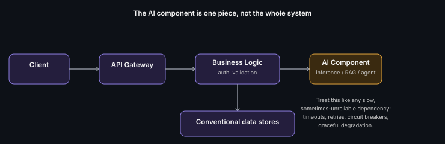

# Where AI Fits in Product Architecture

**Read time:** 3 min

---

The mistake that gives away an inexperienced answer in an interview:
treating "the AI system" as the whole architecture, when in a real
product it's almost always one component embedded in a much larger,
mostly-conventional system.

## The pattern that actually holds up

A real AI-powered feature usually looks like: client → API gateway →
**conventional business logic** (auth, validation, orchestration) → **AI
component** (inference call, RAG pipeline, agent) → conventional data
stores and downstream services. The AI part is a specialized service the
rest of the system calls into — not a replacement for the rest of the
system.

## What this means for how you answer a design question

- **Scope the AI component explicitly, then move on to the rest** — a
  strong answer spends real time on auth, data flow, and failure handling
  around the AI call, not just the AI call itself
- **Treat the AI component like any other slow, sometimes-unreliable
  downstream dependency** — timeouts, retries, circuit breakers, and
  graceful degradation all apply, same as calling any third-party API
- **Identify what's deterministic vs. non-deterministic in the flow** —
  everything before and after the AI call is usually deterministic and
  testable normally; the AI call itself needs the different evaluation
  mindset covered elsewhere in this repo family

## Interview signal

Saying "here's how the AI component fits into the broader request flow,
and here's how the rest of the system stays resilient if it's slow or
wrong" signals more seniority than diving straight into model/prompt
details — it shows you're architecting a *system*, not just calling an API.

---
*Part of [AI Systems Architecture](../README.md) → [AI Application Architecture Fundamentals](./README.md)*
