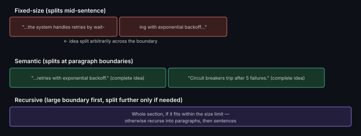

# Chunking Strategies

**Read time:** 3 min

---

Chunking — splitting source documents into retrievable pieces — is the
single decision in a RAG pipeline that most directly determines
retrieval quality, and it's genuinely underrated relative to how much
interview attention goes to embedding models instead.

## The three common strategies

- **Fixed-size chunking** — split every N tokens/characters, often with
  overlap between chunks. Simple, predictable, but can split a coherent
  idea across two chunks arbitrarily, hurting retrieval quality for
  anything that spans a boundary.
- **Semantic/structure-aware chunking** — split at natural boundaries
  (paragraphs, sections, headers) rather than a fixed size. Better
  preserves meaning within a chunk, at the cost of variable chunk sizes
  that are harder to reason about uniformly.
- **Recursive chunking** — try splitting at the largest natural boundary
  first (sections), and recurse into smaller boundaries (paragraphs,
  sentences) only if a chunk is still too large — a practical middle
  ground between the two above.

## Why chunk size is a real trade-off, not just a tuning knob

- **Too large:** each chunk contains more context (good), but retrieval
  becomes less precise (a chunk might be "mostly" relevant, diluting the
  signal), and fewer chunks fit in the context window at a given top-k
- **Too small:** more precise retrieval, but each chunk may lack
  surrounding context needed to actually answer the query — a fact
  without its qualifying sentence can be actively misleading

## Overlap between chunks

A common fix for the "split mid-idea" problem — chunks overlap by a
fixed amount so a boundary-crossing idea likely appears intact in at
least one chunk. Costs some storage/retrieval redundancy for
meaningfully better boundary handling.

## Interview signal

If asked to design a RAG system, proactively naming *why* you'd choose a
specific chunking strategy for the specific content type in the
question (legal documents vs. chat logs vs. code) — rather than just
saying "chunk it" — is one of the highest-leverage places to show real
depth in a RAG design question.

---
*Part of [AI Systems Architecture](../README.md) → [RAG Pipeline Architecture](./README.md)*
