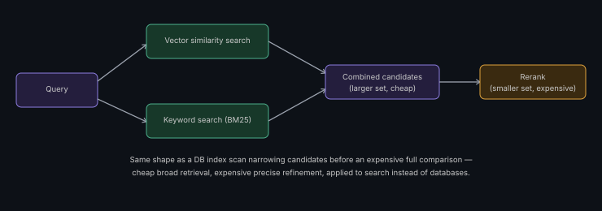

# Hybrid Search & Reranking

**Read time:** 3 min

---

Pure vector similarity search is the default most people describe in an
interview — but it has a real, specific weakness worth naming, and
hybrid search is the production-grade fix.

## The weakness in pure vector search

Vector similarity captures *semantic* meaning well but can miss exact
keyword/entity matches — a query for a specific product code, error
code, or proper noun can retrieve semantically-similar-but-wrong results
if the exact term isn't well-represented in the embedding space.

## Hybrid search: combine vector + keyword

Run both a vector similarity search and a traditional keyword search
(BM25 or similar) against the same query, then combine the results —
catching both semantic matches and exact-term matches that pure vector
search alone might miss.

## Reranking: a second, more expensive pass on fewer candidates

Retrieve a larger candidate set cheaply (via vector/hybrid search), then
run a smaller, more computationally expensive reranking model over just
those candidates to reorder them by actual relevance to the query — a
two-stage pattern that balances cost (expensive reranking only runs on a
small candidate set) against quality (the final ranking is more accurate
than the cheap first pass alone).

## Why this two-stage pattern is worth naming explicitly

It's the same underlying idea as a database query using a cheap index
scan to narrow candidates before an expensive full comparison — cheap
broad retrieval, expensive precise refinement, applied to search instead
of databases. Recognizing and naming that pattern-reuse is itself a
signal of transferable systems thinking, not just RAG-specific trivia.

## Interview signal

If a RAG design question involves precise terms (product codes, names,
IDs) rather than purely conversational queries, proactively suggesting
hybrid search over pure vector search — and explaining *why* — is a
concrete, specific improvement over a generic RAG answer.

---
*Part of [AI Systems Architecture](../README.md) → [RAG Pipeline Architecture](./README.md)*
