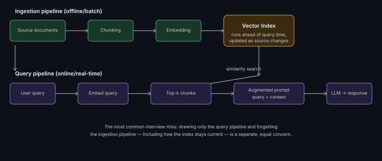

# Retrieval Architecture Fundamentals

**Read time:** 4 min

---

RAG (Retrieval-Augmented Generation) is the most commonly asked AI
system design pattern in interviews right now — knowing the full
pipeline shape cold, not just "it retrieves stuff," is the actual bar.

## The two pipelines, not one

**Ingestion pipeline (offline/batch):** source documents → chunking →
embedding → stored in a vector index. This runs ahead of time, whenever
source content changes.

**Query pipeline (online/real-time):** user query → embed the query →
similarity search against the vector index → retrieve top-k relevant
chunks → construct an augmented prompt (query + retrieved context) → LLM
generates the response.

**The trap to avoid in an interview:** describing only the query
pipeline and forgetting the ingestion pipeline exists as a separate,
equally important concern — including how it handles updates to source
data over time.

## The design decisions that actually matter

- **Chunking strategy** — see [Chunking Strategies](./chunking-strategies.md)
  for the full breakdown; this single decision affects retrieval quality
  more than almost anything else in the pipeline
- **Embedding model choice** — affects retrieval quality and cost;
  domain-specific embeddings can meaningfully outperform general-purpose
  ones for specialized content
- **Top-k retrieval count** — too few misses relevant context; too many
  adds noise (and cost) to the prompt — this is a tunable, not a fixed
  constant, worth naming as a trade-off
- **Retrieval method** — pure vector similarity vs. hybrid (see
  [Hybrid Search & Reranking](./hybrid-search-and-reranking.md))

## Interview signal

Draw the ingestion and query pipelines as two separate flows, explicitly.
Most candidates only draw the query flow — showing you understand *both*
halves, including how the index gets built and stays current, is a
genuine differentiator in this specific, extremely common question type.

---
*Part of [AI Systems Architecture](../README.md) → [RAG Pipeline Architecture](./README.md)*
