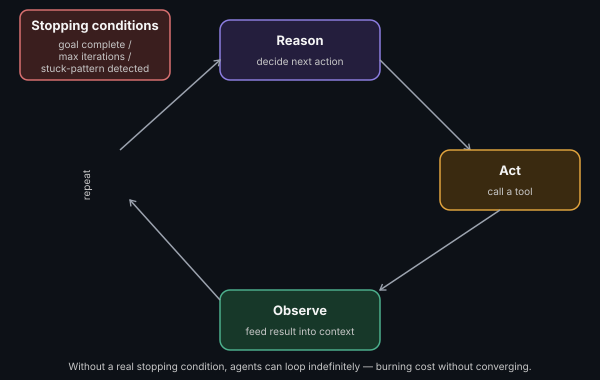

# Agent Orchestration Patterns

**Read time:** 4 min

---

An "agent" — an LLM that can reason about a goal, take actions, observe
results, and iterate — has a specific underlying execution loop. Knowing
that loop cold is the foundation everything else in this section builds on.

## The core loop (often called ReAct: Reason + Act)

1. **Reason** — the LLM considers the goal and current state, decides
   what to do next
2. **Act** — it takes an action (calls a tool, queries data, asks a
   clarifying question)
3. **Observe** — the result of that action is fed back into the context
4. **Repeat** until the goal is achieved or a stopping condition is hit
   (max iterations, explicit completion signal, or a failure state)

## Why this differs fundamentally from a single inference call

A plain LLM call is one request, one response. An agent is a *loop* —
the same underlying model gets called repeatedly, each time with updated
context reflecting what's happened so far. Architecturally, this means
an agent isn't "a bigger prompt" — it's a control-flow structure with
its own state, stopping conditions, and failure modes to design for
explicitly.

## The stopping condition is a real design decision

Agents that don't have a well-designed stopping condition can loop
indefinitely, burning cost and latency without converging — this is a
genuine, common production failure mode, not a hypothetical. A real
design needs: a max-iteration cap, a way for the agent to signal genuine
completion, and ideally a way to detect it's stuck in a repeating pattern
and stop early.

## Interview signal

Drawing the reason-act-observe loop and explicitly naming the stopping
condition mechanism is a stronger answer than describing an agent as "an
LLM that uses tools" — the loop structure and its termination behavior
are where the actual engineering complexity lives.

---
*Part of [AI Systems Architecture](../README.md) → [Agentic AI & Multi-Agent Systems](./README.md)*
