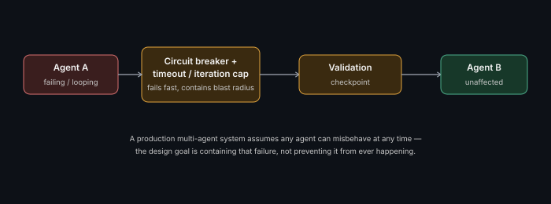

# Failure Isolation Between Agents

**Read time:** 3 min

---

In a multi-agent system, one agent's failure or misbehavior shouldn't
be able to take down or corrupt the entire system — this is the same
failure-isolation instinct from distributed systems, applied to agents
specifically.

## Failure modes specific to multi-agent systems

- **One agent gets stuck in a loop** — without isolation, this can
  consume the whole system's time/cost budget while other work waits
- **One agent produces a bad/hallucinated result** — if downstream
  agents trust it uncritically, the error propagates and compounds
  through the rest of the pipeline
- **One agent's tool call fails repeatedly** — without a circuit
  breaker, it can keep retrying and blocking progress instead of failing
  fast and letting the system route around it

## Isolation mechanisms, borrowed directly from distributed systems

- **Per-agent timeouts and iteration caps** — bound how much any single
  agent can consume before being forcibly stopped
- **Circuit breakers per tool/agent** — same
  [circuit breaker](https://github.com/abhibatsa/lld-and-ood-interview-prep/blob/main/design-patterns/behavioral/chain-of-responsibility.md)-adjacent
  concept from traditional systems: after repeated failures, stop
  calling a failing agent/tool and fail fast instead
- **Validation between agent handoffs** — don't pass one agent's output
  directly to the next without a sanity check; a supervisor pattern
  (see [Multi-Agent Coordination Patterns](./multi-agent-coordination-patterns.md))
  naturally provides a place to validate before continuing

## Why this is the differentiator between a demo and a production system

A demo multi-agent system usually assumes every agent behaves correctly.
A production one assumes any agent can misbehave at any time, and is
architected so that failure stays contained rather than cascading. This
is precisely the same maturity gap between a proof-of-concept
distributed system and a production-grade one.

## Interview signal

Bringing up failure isolation unprompted in a multi-agent design
question — before being asked "what if an agent fails" — is a strong
signal, because it shows the failure case is part of your default design
thinking, not an afterthought raised only when probed.

---
*Part of [AI Systems Architecture](../README.md) → [Agentic AI & Multi-Agent Systems](./README.md)*
