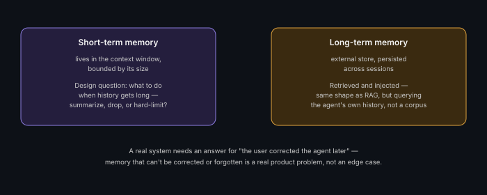

# Memory and State Design for Agents

**Read time:** 3 min

---

"Memory" for an agent isn't one thing — it's at least two architecturally
different concerns, and conflating them is a common design gap in
interview answers.

## Short-term memory — the context window

The conversation/reasoning history within a single session — what's
been said, what tools have been called, what's been observed. This lives
directly in the model's context window and is inherently bounded by its
size. Architecturally, the concern here is **what to include when the
history gets long**: summarizing older turns, dropping less-relevant
history, or hitting a hard context limit.

## Long-term memory — persisted across sessions

Facts, preferences, or history that should persist *beyond* a single
conversation — typically implemented as an external store (often a
vector store for semantic retrieval, sometimes a structured database for
specific facts), queried and injected into context as relevant, similar
in shape to a RAG retrieval step but retrieving *about the user/agent's
own history* rather than a document corpus.

## The design questions that actually matter

- **What's worth persisting at all?** Not everything from a session
  needs to become long-term memory — deciding what's actually worth
  keeping is a real design decision, not a default
- **How is long-term memory retrieved and injected?** Same trade-offs as
  RAG retrieval — how much, how relevant, what happens if retrieval pulls
  in something stale or contradictory
- **How does memory get corrected or forgotten?** A real system needs an
  answer for "the user told the agent something, then later said it was
  wrong" — memory that can't be corrected is a real product problem, not
  just an edge case

## Interview signal

Distinguishing short-term (context window) from long-term (persisted,
retrieved) memory explicitly — rather than treating "give the agent
memory" as one undifferentiated feature — is the concrete signal that
separates a surface-level answer from one grounded in how these systems
actually get built.

---
*Part of [AI Systems Architecture](../README.md) → [Agentic AI & Multi-Agent Systems](./README.md)*
