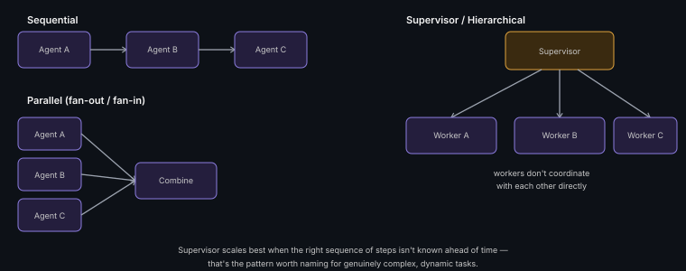

# Multi-Agent Coordination Patterns

**Read time:** 4 min

---

Once a design needs more than one agent, a new question arises that
single-agent orchestration doesn't cover: how do multiple agents
actually coordinate? Three patterns cover most real designs.

## Sequential (pipeline)

Agent A's output becomes Agent B's input, becomes Agent C's input — a
linear handoff chain. Simple to reason about and debug (failures are
localized to one stage), but total latency is the sum of every stage,
and there's no parallelism.

**Use when:** each stage genuinely depends on the previous stage's
completed output (e.g., a research agent's findings feed a writing
agent).

## Parallel (fan-out/fan-in)

Multiple agents work on independent sub-tasks simultaneously, and their
results are combined at the end. Faster (parallel, not additive
latency), but requires the sub-tasks to genuinely be independent, and
needs a clear combination/aggregation strategy for the results.

**Use when:** a task naturally decomposes into independent pieces (e.g.,
researching three unrelated topics simultaneously).

## Supervisor/hierarchical

One "supervisor" agent decides which specialized "worker" agent(s) to
delegate to, and orchestrates the overall flow — the worker agents don't
coordinate with each other directly, only through the supervisor. This
is the pattern that scales best to complex, dynamic tasks where the
right sequence of steps isn't known in advance.

**Use when:** the task's structure isn't fixed ahead of time — the
supervisor's job is deciding *which* agents to invoke and *in what
order*, based on what's already been learned.

## Interview signal

Naming which of these three patterns fits a specific scenario — and
why — is a much stronger answer than "we'd use multiple agents." The
supervisor pattern in particular is the one worth reaching for when a
design question involves genuine complexity/unpredictability in the task
structure, and naming that explicitly shows real judgment, not just
pattern recall.

---
*Part of [AI Systems Architecture](../README.md) → [Agentic AI & Multi-Agent Systems](./README.md)*
