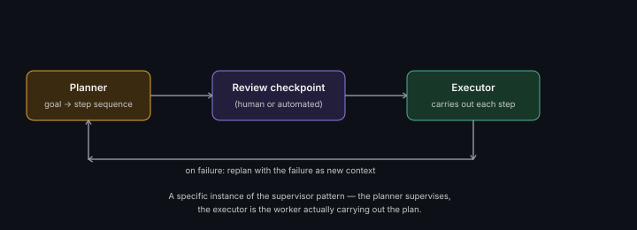

# Planner-Executor Architecture

**Read time:** 3 min

---

A specific, common agentic pattern worth knowing by name: splitting the
"decide what to do" responsibility from the "actually do it" responsibility
into two separate roles, rather than one agent handling both together.

## The split

**Planner** — reasons about the overall goal and produces a plan (a
sequence of steps), without necessarily executing any of them itself.

**Executor** — takes each step from the plan and actually carries it
out (which may itself involve tool calls, sub-agents, or further
reasoning), reporting results back.

## Why split these at all, instead of one agent doing both

- **Cheaper, faster planning** — planning is often a lighter-weight
  reasoning task than execution; using a smaller/cheaper model for
  planning and a more capable one only where execution actually needs it
  is a real cost optimization (same idea as
  [model routing](../01-ai-application-architecture-fundamentals/cost-architecture-for-ai-systems.md))
- **Plan review as a checkpoint** — a produced plan can be validated
  (by a human, or a separate check) *before* any actions are actually
  taken — a natural safety checkpoint that's harder to insert cleanly
  into a single combined reason-and-act loop
- **Replanning on failure** — if a step fails, the planner can be
  re-invoked with the failure as new context to produce a revised plan,
  rather than the whole agent's reasoning being entangled with recovering
  from one failed action

## Where this connects to the rest of this section

This is a specific instance of the
[supervisor pattern](./multi-agent-coordination-patterns.md) — the
planner behaves like a supervisor deciding what should happen, while
executors are the workers actually doing it. Worth naming that
connection explicitly if asked to compare patterns.

## Interview signal

If a design question involves any multi-step task where the exact
sequence should be reviewable or auditable before execution (e.g.,
anything with real-world side effects — sending money, deleting data),
proposing planner-executor with a review checkpoint between the two is a
concrete, safety-conscious architectural answer.

---
*Part of [AI Systems Architecture](../README.md) → [Agentic AI & Multi-Agent Systems](./README.md)*
