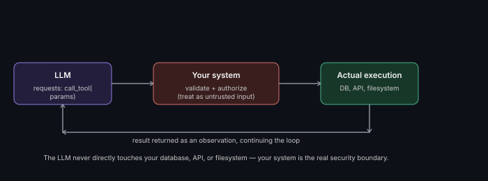

# Tool-Calling Architecture

**Read time:** 3 min

---

Tool calling — an LLM invoking an external function/API as part of its
reasoning — is the mechanism that turns a language model from "generates
text" into "can actually act on the world." The architecture around it
matters more than most people expect going into an interview.

## The request cycle

1. The LLM is given a set of available tools (name, description,
   parameter schema) as part of its context
2. Based on the current reasoning step, it outputs a structured request
   to call a specific tool with specific parameters
3. **Your system**, not the model, actually executes that call — the LLM
   never directly touches your database, API, or filesystem
4. The result is returned to the LLM as an observation, continuing the
   [orchestration loop](./agent-orchestration-patterns.md)

## The architectural point most people miss

The LLM only ever *requests* a tool call — it doesn't execute anything
itself. This means **your system is the actual security boundary and
execution environment**, and every tool call should be validated,
authorized, and sandboxed the same way you'd treat any external,
untrusted input — because the LLM's output requesting a specific call is,
functionally, untrusted input.

## Designing the tool interface itself

- **Narrow, well-described tools beat one giant flexible tool** — a
  model reasons more reliably about "search_orders(customer_id)" than
  about a single generic "run_query(sql)" tool, which is also a much
  larger security surface
- **Return structured, predictable results** — the LLM has to reason
  about the tool's output in the next step; unpredictable or overly
  verbose results make that harder
- **Design for tool failure explicitly** — what does the agent do if a
  tool call errors out? This needs a defined behavior, not an assumption
  it always succeeds

## Interview signal

Explicitly stating "the model requests, my system executes and
validates" — and treating tool-call parameters as untrusted input needing
validation — is the single strongest signal of production experience in
this specific topic. It's also the direct architectural link to
[Guardrails & AI Safety Architecture](../08-guardrails-and-ai-safety-architecture).

---
*Part of [AI Systems Architecture](../README.md) → [Agentic AI & Multi-Agent Systems](./README.md)*
